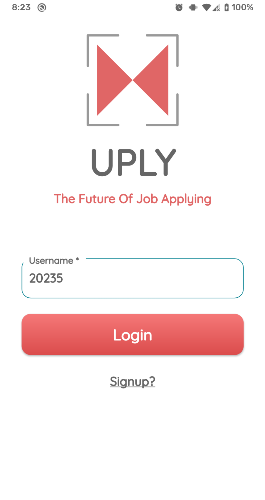
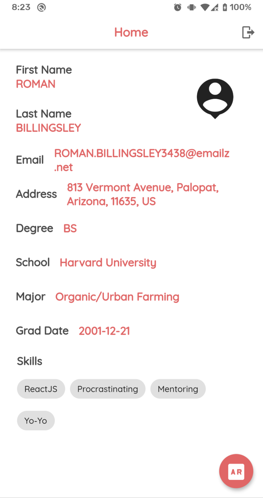
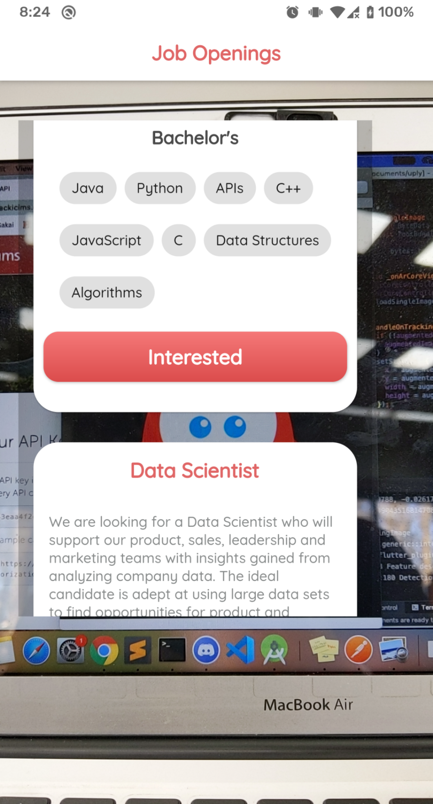

<h1 align="center" style="border-bottom: none;">UPLY ("you-apply")</h1>
<h3 align="center">The future of job applying using Augmented Reality</h3>

------------------------------------------------------------------------------------------------------

App Demo: https://www.youtube.com/watch?v=OG5CEfn53Oo&feature=youtu.be

## Inspiration

* We were looking for a fresh approach to job hunting and learning about opportunities and sponsors at Hackathons.  

## What It Does

* "UPLY" uses AR-Core library and Flutter (a cross-platform framework) to render user profile and job openings using Augmented Reality. UPLY could be used to learn more about sponsors and have a meaningful conversation when you get an opportunity to talk to them.

## How We Built It

* We used Flutter for user interface and user experience. Ar-Core to render augmented interface and iCIMs API to fetch job, application, and user data.

## Challenges We Ran Into

* One of the most challenging thing we faced was integrating ArCore with Flutter and displaying augmented images on a screen.

## Accomplishments That We're Proud Of

* Honestly, coming up with this idea and putting all together was quite interesting and adventurous. We are so happy that we were able to bring our thoughts a reality using augmented reality. 

## What We Learned

* ArCore functionalities, APIs, and advanced user interface with Flutter.  

## What's Next For UPLY

* Implement Google Maps AR tech into this app (you might have seen that AR street view navigation feature)
* Add predictive ML models to make better decisions on when survivors can rescue themselves
* Send a push notification letting the user know that what are the chances of natural disasters hitting their area and suggest to download AR Map in advance which will have pre-selected rescue camps.
* And many more to come

## Getting Started With Flutter

This project is a starting point for a Flutter application.
A few resources to get you started if this is your first Flutter project:

- [Lab: Write your first Flutter app](https://flutter.dev/docs/get-started/codelab)
- [Cookbook: Useful Flutter samples](https://flutter.dev/docs/cookbook)

For help getting started with Flutter, view our
[online documentation](https://flutter.dev/docs), which offers tutorials,
samples, guidance on mobile development, and a full API reference.
